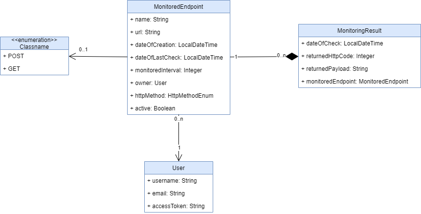

## Applifting Java BE task - implementation
### What I have done
I created a Java Spring Boot application using multi-tier architecture.
### Tasks done
- CRUD of Monitored URLs 
- I simulate periodical monitoring of URLs by sending an HTTP request. I have done this becaue I don't know how to schedule a task based on the "monitored interval" attribute, so I used an extra endpoint as a workaround. Perhaps this way another node in the microservice architecture could be sending those requests to check on registered URLs.
- I successfully implemented listing of 10 last monitored results for each particular monitored URL
- Users must authorize themselves by sending their access token in "Applifting-Authorization" HTTP header.
- Authorization was implemented also. Each user is authorized to view only his/hers MonitoredEndpoints and MonitoredResults.
- I have written unit tests using JUnit with Mockito library.
### Endpoints
#### /monitoredEndpoint
- GET / - lists all MonitoredEndpoint entities available to authenticated user
- GET /{name} - list MonitoredEndpoint by its name attribute
- DELETE /delete - delete (actually deactivate) MonitoredEndpoint by URL and user who owns 
- PATCH /edit - edit existintg MonitoredEndpoint
- POST /create - Create new MonitoredEndpoint
#### /monitoring
- GET /list - lists last 10 MonitoringResult for each MonitoringEndpoint owned by authenticated user
- POST /check - make a request to MonitoredEndpoint and create a MonitoringResult
### Validation
User can create new MonitoredEndpoints so it is crucial that this is the entity for which input must be validated. 
When user wishes to register new MonitoredEndpoint I validate that the name, monitoredInterval are set.
Also before persisting I validate that the url given is a valid one and that it doesn't return 404 Not found HTTP status.
### Entity Model
I used the suggested entity model from the original task sheet. I added an "active" flag attribute to MonitoredEndpoint which gets set to false if user wishes to delete that URL. 
Also I added "httpMethod" attribute to better differentiate between endpoints. However I only allow HTTP GET for the sake of this task.

### Notes about DB
- The values of User were hardcoded using SQL Insert command.
- Column returnedPayload was altered to be VARCHAR(10000) instead of VARCHAR(255) so I wouldn't receive an error if returned payload was too large.
### How to start using Docker
- Pull the source code
- Fill your DB connection values into application.properties
    - spring.datasource.url must be corresponding to mysql docker image, e.g jdbc:mysql://mysql-al:3306/applifting
- Build from the root of this project using command: docker build -t applifting-task:1.0 .
- Run using: docker-compose -f docker-compose.yaml up -d
### Conclusion
I really enjoyed implementing this task. I better learned how Spring Boot handles authentication which ended up being very simple for this project.  
I also got to work with MySQL for the first time as I mostly use PostgreSQL. I think MySQL workbench is a much friendlier DB client than pgAdmin.  
I implemented this task how I know so I hope you will enjoy reading through my code and hopefully we will be in touch.
